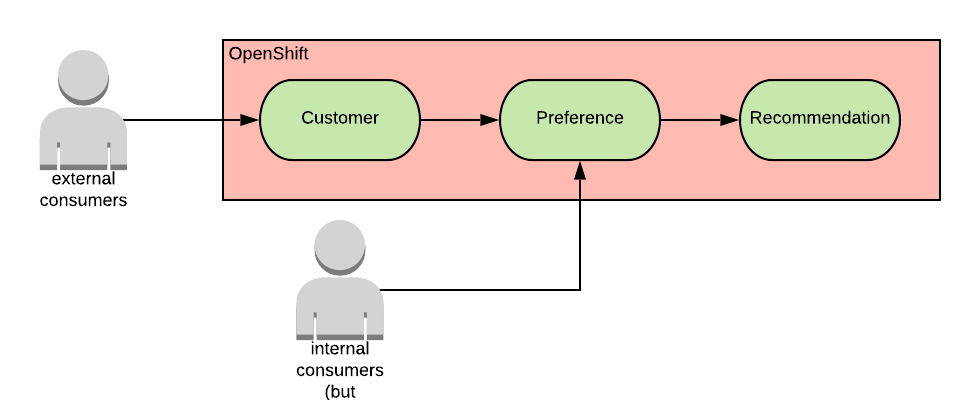
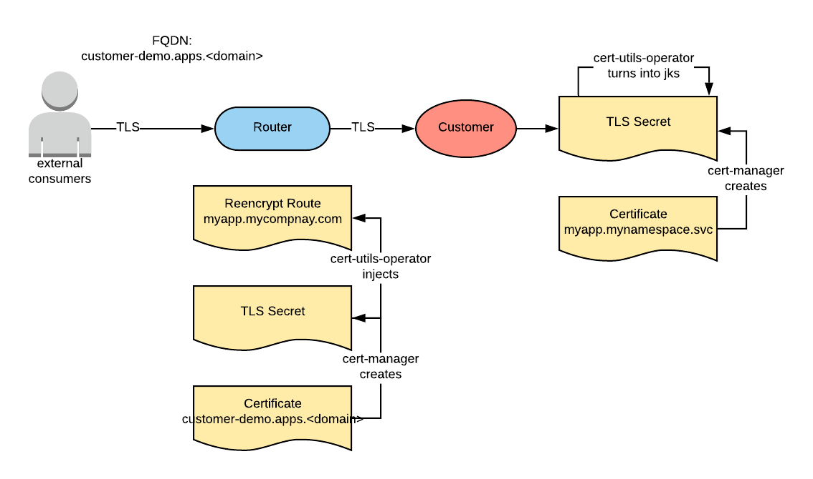
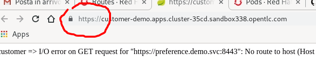
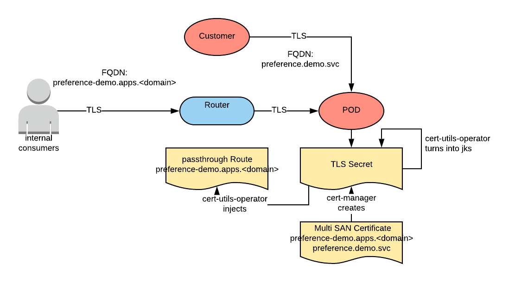
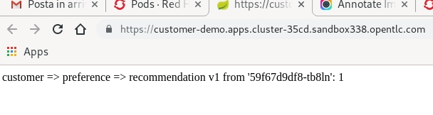
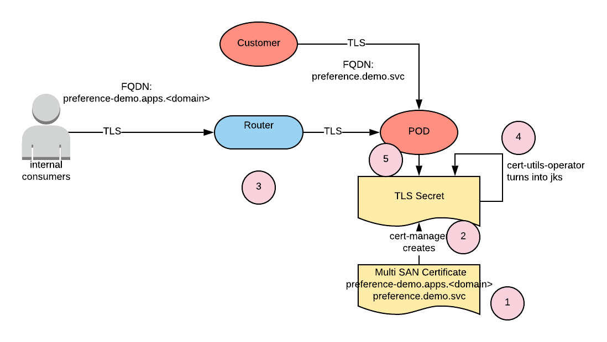

# End to End Encryption Demo

this is a demo on how to create and end to end encryption for a group of microservice with self-serviced certificates.
This demo will show step by step how to secure services for andragogical purposes. In a real CI/CD scenario Kubernetes resources would be create with the correct configuration.



You can watch a recording of the demo here:

[](http://www.youtube.com/watch?v=iwqysvAZ-m8 "end to end encryption demo")

## Deploying the needed operators

### Deploying cert-manager

[cert-manager](https://github.com/jetstack/cert-manager) is our certificate provisioning operator. It makes certificates a first class resource inside of OpenShift.

```shell
oc new-project cert-manager
oc label namespace cert-manager certmanager.k8s.io/disable-validation=true
oc apply --validate=false -f https://github.com/jetstack/cert-manager/releases/download/v0.9.0/cert-manager-openshift.yaml
oc patch deployment cert-manager -n cert-manager -p '{"spec":{"template":{"spec":{"containers":[{"name":"cert-manager","args":["--v=2","--cluster-resource-namespace=$(POD_NAMESPACE)","--leader-election-namespace=$(POD_NAMESPACE)","--dns01-recursive-nameservers=8.8.8.8:53"]}]}}}}'
```

### Deploying cert-utils-operator

[cert-utils-operator](https://github.com/redhat-cop/cert-utils-operator) provides some additional features to managing certificates, such as injection of certificates in routes.

```shell
oc new-project cert-utils-operator
helm repo add cert-utils-operator https://redhat-cop.github.io/cert-utils-operator
helm repo update
export cert_utils_chart_version=$(helm search cert-utils-operator/cert-utils-operator | grep cert-utils-operator/cert-utils-operator | awk '{print $2}')
helm fetch cert-utils-operator/cert-utils-operator --version ${cert_utils_chart_version}
helm template cert-utils-operator-${cert_utils_chart_version}.tgz --namespace cert-utils-operator | oc apply -f - -n cert-utils-operator
rm cert-utils-operator-${cert_utils_chart_version}.tgz
```

### Deploy Reloader

When a certificate is renewed, the files will be updated on the container's file system. Unless the app is written to watch those files, we need to restart the application. We are going to make that happen with the [Reloader](https://github.com/stakater/Reloader) operator

```shell
oc new-project reloader
helm repo add stakater https://stakater.github.io/stakater-charts
helm repo update
export reloader_chart_version=$(helm search stakater/reloader | grep stakater/reloader | awk '{print $2}')
helm fetch stakater/reloader --version ${reloader_chart_version}
helm template reloader-${reloader_chart_version}.tgz --namespace reloader --set isOpenshift=true | oc apply -f - -n reloader
rm reloader-${reloader_chart_version}.tgz
```

## Configuring the Certificate Authorities

### Deploying the Let's Encrypt cluster issuer

[Let's Encrypt](https://letsencrypt.org/) represent our CA for externally visible certificates (i.e. certificates that have to be trasuted by browser and OSs of our customers). Currently this works only with OCP 4.x on AWS.

```shell
export EMAIL=<your-lets-encrypt-email>
oc apply -f issuers/aws-credentials.yaml
sleep 5
export AWS_ACCESS_KEY_ID=$(oc get secret cert-manager-dns-credentials -n cert-manager -o jsonpath='{.data.aws_access_key_id}' | base64 -d)
export REGION=$(oc get nodes --template='{{ with $i := index .items 0 }}{{ index $i.metadata.labels "failure-domain.beta.kubernetes.io/region" }}{{ end }}')
export zoneid=$(oc get dns cluster -o jsonpath='{.spec.publicZone.id}')
envsubst < issuers/lets-encrypt-issuer.yaml | oc apply -f - -n cert-manager
```

### Create the internal CA issuer

We assume that services that are not exposed internally get their certificates from an internal issuer (external issuer usually have a cost based on the number of certificates). To simulate this situation we are going to use the internal CA issuer from cert-manager.

```shell
oc apply -f issuers/internal-issuer.yaml -n cert-manager
```

## Deploying the Microservices Customer -> Preference -> Recommendation

you can find the application described [here](https://redhat-developer-demos.github.io/istio-tutorial/istio-tutorial/1.1.x/2deploy-microservices.html#deploycustomer)

Deploy it with the following:

```shell
oc new-project demo

oc apply -f customer/kubernetes/Deployment.yml -n demo
oc apply -f customer/kubernetes/Service.yml -n demo

oc apply -f preference/kubernetes/Deployment.yml -n demo
oc apply -f preference/kubernetes/Service.yml -n demo

oc apply -f recommendation/kubernetes/Deployment.yml -n demo
oc apply -f recommendation/kubernetes/Service.yml -n demo
```

At this point the pods will be failing because they expect certificates which have not been provided yet.

### Securing the customer microservice

The customer service will be exposed externally via the router. The customer service route will present a trusted certificate from the let's encrypt CA and configured to re-encrypt to customer pod. The customer service pod will present a certificate from the internal CA.



```shell
## create the route
oc create route reencrypt customer --service=customer --port=https -n demo
## create the external certificate
namespace=demo route=customer host=$(oc get route $route  -n $namespace -o jsonpath='{.spec.host}') envsubst < certificates/ACME-certificate.yaml | oc apply -f - -n demo
## create internal certificate
service=customer namespace=demo envsubst < certificates/internal-certificate.yaml | oc apply -f - -n demo;
## annotate the secret to create keystores
oc annotate secret service-customer -n demo cert-utils-operator.redhat-cop.io/generate-java-keystores=true;
## mount the secret to the pod
oc set volume deployment customer -n demo --add=true --type=secret --secret-name=service-customer --name=keystores --mount-path=/keystores --read-only=true
## annotate the route to use the certificate
oc annotate route customer -n demo cert-utils-operator.redhat-cop.io/certs-from-secret=route-customer
## make the route trust the internal certificate
oc annotate route customer -n demo cert-utils-operator.redhat-cop.io/destinationCA-from-secret=service-customer
```

Connecting to this service via the route you should see that the browser trusts the certificate.



### Securing the preference microservice

The preference microservice needs to be called by the customer microservice. The customer microservice trusts the internal CA, so we need to give the preference microservice a certificate from the internal CA. For educational purposes we will also expose this service via a passthrough route to see that configuration. This route will not be trusted by the browsers. This configuration requires a certificate with two SANs.



```shell
## create the passthrough route
oc create route passthrough preference --service=preference --port=https -n demo
## create the two-SANs certificate
namespace=demo route=preference host=$(oc get route $route  -n $namespace -o jsonpath='{.spec.host}') service=preference envsubst < certificates/multiSAN-internal-certificate.yaml | oc apply -f - -n demo
## annotate the secret to create keystores
oc annotate secret route-service-preference -n demo cert-utils-operator.redhat-cop.io/generate-java-keystores=true;
## mount the secret to the pod
oc set volume deployment preference-v1 -n demo --add=true --type=secret --secret-name=route-service-preference --name=keystores --mount-path=/keystores --read-only=true
```

### Securing the recommendation service

The recommendation service will be internal only.

```shell
service=recommendation namespace=demo envsubst < certificates/internal-certificate.yaml | oc apply -f - -n demo;
## annotate the secret to create keystores
oc annotate secret service-recommendation -n demo cert-utils-operator.redhat-cop.io/generate-java-keystores=true;
## mount the secret to the pod
oc set volume deployment recommendation-v1 -n demo --add=true --type=secret --secret-name=service-recommendation --name=keystores --mount-path=/keystores --read-only=true
```

At this point the app should be working.



## Manage certificate renewal

At certificate renewal the following happens:



1. Cert-manager contacts the configured CA to get a new certificate.
2. Cert-manager replaces the secret content with the new certificate files.
3. If a route is configured to use that certificate, cert-utils operator updates the route TLS configuration.
4. If a certificate secret is annotated to expose the certificate in keystore format, cert-utils operator refreshes the keystore and truststore fields.
5. If a certificate secret is mounted by a pod, then Kubernetes updates the content of the secret in the pod’s file system.

If your app cannot reload its configuration upon a configuration file change, you can use an operator to restart your app for you.

### Configure deployments to reload upon certificate change

```shell
oc annotate deployment customer -n demo secret.reloader.stakater.com/reload=service-customer;
oc annotate deployment preference-v1 -n demo secret.reloader.stakater.com/reload=route-service-preference;
oc annotate deployment recommendation-v1 -n demo secret.reloader.stakater.com/reload=service-recommendation;
```

### Testing certificate renewal

Let's use the preference service to test the certificate renewal. We can do that by creating a very short live certificate:

```shell
oc patch certificate preference -n demo -p '{"spec":{"duration":"1h1m","renewBefore":"1h"}}' --type=merge
oc delete secret route-service-preference -n demo
sleep 5
oc annotate secret route-service-preference -n demo cert-utils-operator.redhat-cop.io/generate-java-keystores=true;
```

with this setting we should see the preference deployment redeploy every minute.
